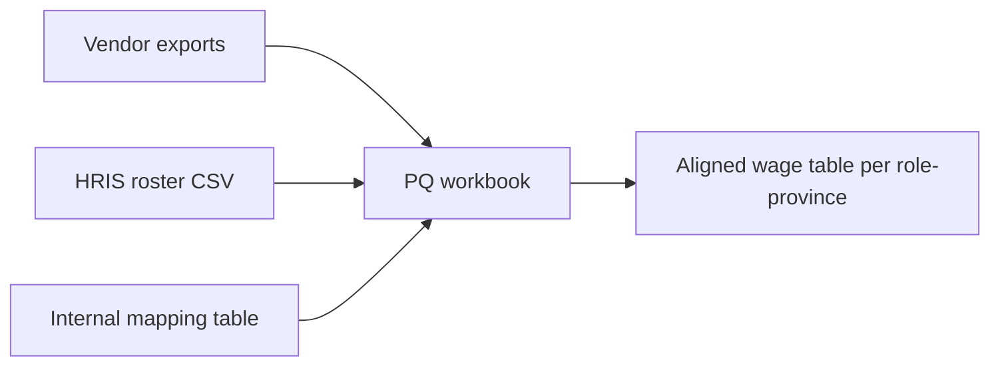
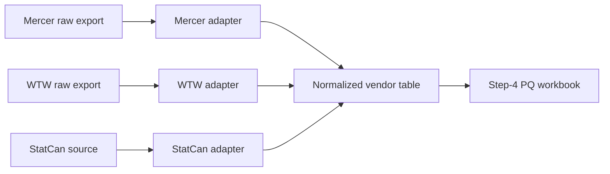

# Transformation Brief: Annual Wage Scale Review

## Band Summary (categorical, not weighted)

| Candidate | Band | Rationale (one line) |
|-----------|------|----------------------|
| Consolidate deck template | Quick Win | already in diagnosis Quick Wins — link to diagnosis instead |
| Document carryover logic | Quick Win | already in diagnosis Quick Wins |
| Roster export contract | Quick Win | already in diagnosis Quick Wins |
| Power Query adoption across all analysts | Strong Candidate | clear ROI (12h/cycle saved per analyst), slack window in 2026-Q4, no integration unknowns |
| Survey vendor format adapter (Mercer, WTW, StatCan) | Strong Candidate | clear ROI (16h/cycle saved), integration path known (Power Query workbook per vendor), slack window in 2026-Q4 |
| VP pre-review at step 7 (process change, not automation) | Needs Groundwork | requires VP buy-in; change-management dependency |
| Roster reconciliation auto-check | Needs Groundwork | depends on roster export contract (Quick Win #3) shipping first |
| Agentic benchmarking pipeline | Not Ready | speculative; no clear ROI vs vendor format adapter; against current cycle gating with no slack until 2027 |

---

## Strong Candidates — buildable specs

### Power Query adoption across all analysts

#### Work components (work-decomposer 4-tuple)

- **Input:** Vendor exports (Mercer Excel, WTW CSV, StatCan PDF), HRIS roster CSV, internal mapping tables
- **Context:** Comp team has 3 analysts. One uses Power Query in step 4 (12h); two use manual VLOOKUP (24h). Power Query workbook exists but isn't shared. Goal: one canonical workbook, three trained analysts.
- **Process:** Build a shared Power Query workbook with parameterized inputs (vendor source, year, scope). Train two non-PQ analysts via two 90-min sessions. Run a parallel cycle where all three analysts use PQ for steps 4-5; capture training gaps.
- **Output:** Single shared `step4-step5-pq-workbook.xlsx` in comp-team shared folder. Three trained analysts. Step 4 cycle time: 24h → 12h per analyst. Bus-factor: 1 → 3.

#### Architecture

- **Type:** simple
- **Diagram:**



#### Agent roles

This is not an agentic transformation — it's a tooling adoption. No agent roles. Power Query is the "agent" in the loose sense; the workbook handles the transform.

#### Quality gates

- **Self-critique:** N/A (Power Query is deterministic — no model output to critique)
- **Validation checks:** Output table column count matches expected schema; row count = active employees ± expected churn; sample row spot-check against vendor source
- **Human review points:** Comp Analyst reviews the aligned wage table before step 6 modeling — same review point as today, just earlier and on cleaner data

#### Cycle-fit

- **Earliest viable rollout:** 2026-Q4 (slack window in stage "Effective+post" — weeks +4 to +22)
- **Cycle-gating exception:** none — fits cleanly in slack

#### Test scenario

```
Given:
  - Mercer 2026 grocery survey export (Excel)
  - WTW 2026 retail survey export (CSV)
  - HRIS roster export (CSV) — same format as 2025 cycle
When:
  - Run the PQ workbook with parameters {year: 2026, scope: full-roster}
Then:
  - Aligned wage table outputs in <30 seconds
  - Column schema matches expected (role_id, province, p25, p50, p75, p90, source_vendor, source_year)
  - Row count matches active roster ± 5%
  - Spot-check 5 random rows against vendor source — all match
```

---

### Survey vendor format adapter (Mercer, WTW, StatCan)

#### Work components (work-decomposer 4-tuple)

- **Input:** Raw vendor exports — Mercer (Excel, vendor-specific column names), WTW (CSV, different column names), StatCan (HTML/PDF mix)
- **Context:** Each vendor's format differs and changes year over year. Manual normalization in step 3 takes 16h/cycle. The Power Query workbook (Strong Candidate #1) consumes a normalized table; this candidate produces it. Goal: per-vendor adapter that emits the normalized schema.
- **Process:** Build three adapters (one per vendor): Mercer-adapter (Excel → normalized CSV), WTW-adapter (CSV → normalized CSV), StatCan-adapter (web fetch + parse → normalized CSV). Each adapter is a Power Query / Python script (operator's choice). Adapters chain into the PQ workbook from Strong Candidate #1.
- **Output:** Three callable adapters. Step 3 cycle time: 16h → 4h. Year-over-year format drift caught at adapter run, not at step 5 reconciliation.

#### Architecture

- **Type:** orchestrated
- **Diagram:**



#### Agent roles

##### Role: Vendor adapter (Mercer / WTW / StatCan — one each)

- **Input:** Vendor-specific export (varies per vendor)
- **Task:** Read vendor format, map columns to canonical schema, emit normalized CSV
- **Output:** `<vendor>-normalized-<YYYY>.csv` matching the canonical schema (role_id, province, p25, p50, p75, p90, source_vendor, source_year, retrieval_date)
- **Context/Constraints:** No PII (this data is market-level — no individual records). Schema versioned at `template_assets/canonical-vendor-schema.csv` so downstream PQ workbook depends on a stable contract. Per-vendor adapter handles its vendor's quirks (e.g., Mercer's "level" column → canonical "role_id" via a mapping table).
- **Prompt template:**

```
N/A — this is deterministic data transformation, not generative work.
Each adapter is implemented as a Power Query script or Python script.
Vendor-specific quirks are encoded in a per-vendor mapping table at
template_assets/vendor-mappings/<vendor>.yaml.
```

##### Role: Adapter orchestrator (light wrapper)

- **Input:** Year + scope parameters; list of active vendors
- **Task:** Run each adapter in turn, concatenate outputs, write to `vendor-normalized-<YYYY>-combined.csv`
- **Output:** Combined normalized table consumed by the step-4 PQ workbook
- **Context/Constraints:** Fails loudly on any vendor format change that breaks an adapter — no silent fallback. The error message names the vendor + the column that didn't map.
- **Prompt template:** N/A — orchestrator is a 30-line shell or Python script.

#### Quality gates

- **Self-critique:** N/A (deterministic transformation)
- **Validation checks:** Each adapter output has the full canonical schema columns; row count > 0 (no silent empty); per-vendor sample row spot-check against source. Combined output: vendor coverage matches expected (Mercer rows + WTW rows + StatCan rows = total expected)
- **Human review points:** Comp Analyst reviews the combined normalized table before passing to PQ workbook. Same review point as today, but earlier and on a unified format

#### Cycle-fit

- **Earliest viable rollout:** 2026-Q4 (slack window in stage "Effective+post" — weeks +4 to +22). Build out individual adapters in parallel; integrate with PQ workbook (Strong Candidate #1) before next cycle's step 3.
- **Cycle-gating exception:** none

#### Test scenario

```
Given:
  - Mercer 2026 grocery survey raw export
  - WTW 2026 retail survey raw export
  - StatCan 2026 wage table source URL
When:
  - Run orchestrator with parameters {year: 2026, scope: full-roster, vendors: [mercer, wtw, statcan]}
Then:
  - vendor-normalized-2026-combined.csv emits with 3 vendor sources
  - Schema matches canonical (8 columns)
  - Spot-check 3 random rows per vendor — all values trace to vendor source
  - Mercer adapter handles 2026's new "level_v3" column (which is 2026's name for what was "level_v2" in 2025) — captured in mapping table update
```

---

## Needs Groundwork — dependency notes

- **VP pre-review at step 7**
  - What blocks it: change-management — VP buy-in required
  - Who owns the unblocking: Comp Manager (broaches with VP)
  - What would move it to Strong Candidate: VP confirms willingness to do a 30-min draft-deck review at step 7 instead of formal pitch at step 9
  - Estimated unblocking effort: solo (1 conversation)

- **Roster reconciliation auto-check**
  - What blocks it: Quick Win #3 (roster export contract) must ship first — auto-check needs the contract to know what to validate against
  - Who owns the unblocking: HRIS Owner + Comp Analyst
  - What would move it to Strong Candidate: Quick Win #3 ships and the contract has been used through one cycle without modification
  - Estimated unblocking effort: week (after Quick Win #3 ships)

---

## Not Ready — parked

- **Agentic benchmarking pipeline** — Speculative. The two Strong Candidates above (Power Query adoption + vendor format adapters) cover the high-leverage data-prep work. Going from there to a full agentic pipeline would require validating model output against deterministic vendor data — high integration risk, low marginal ROI vs the adapters. Un-park condition: a vendor stops publishing structured exports and we need extraction from unstructured sources (e.g., PDF-only releases). Track if it surfaces; otherwise re-evaluate in 2027-Q3.

---

## Council dissents (preserved verbatim)

- `change-management` on Power Query adoption: "Two 90-min training sessions during Q4 slack window is fine, but if any analyst is out, training stretches into 2027-Q1 prep weeks. Hold a hard line on training landing in slack — don't accept a slip."
- `comp-manager` on Survey vendor format adapter: "Building three adapters at once is two too many. Start with Mercer (highest hours), prove the pattern, then add WTW and StatCan. Don't sequence three together."
- `hris-tooling` on Survey vendor format adapter: "Don't build three adapters as Strong Candidates. Build one (Mercer) as Strong Candidate, the other two as Needs Groundwork pending pattern validation. Reduce build-risk surface area."
- `hrbp` on VP pre-review at step 7: "Even if VP agrees, getting them to actually show up at step 7 is a behavioral change. Quick Win #1-3 first; build a track record of cycle improvements before asking for VP behavioral change."
