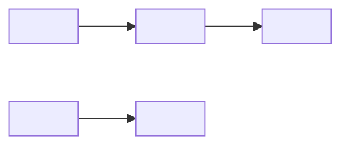

# Roadmap: <Team Name> — <YYYY-Qx>

> Date: YYYY-MM-DD
> Team slug: <slug>
> Cycle anchor: <anchor event date>
> Council state: council-states/<slug>/<date>-roadmap.yaml
> Audience: <comp-team-internal | vp-people | external>
> engagement_mode: <mode_id>   # required — matches a v1 mode in engagement-modes.md

## Executive summary

<one paragraph — what's shipping this quarter, what's deferred, what depends on what. ~3-4 sentences.>

---

## Dependency graph

> Solid lines are direct dependencies. Dashed lines (if used) are soft preferences (e.g., resource sequencing, change-management spacing).

---

## Sequencing

### Now (<YYYY-Qx>)

| Process | Strong Candidate | Slack window | Owner | Leading indicator |
|---------|------------------|--------------|-------|-------------------|
| <process slug> | <candidate slug> | <stage name, weeks +X to +Y> | <role> | <metric to watch in first 30 days> |
| <process slug> | <candidate slug> | <stage name, weeks +X to +Y> | <role> | <metric to watch in first 30 days> |

### Next (<YYYY-Q(x+1)>)

| Process | Strong Candidate | Slack window | Owner | Leading indicator |
|---------|------------------|--------------|-------|-------------------|
| <process slug> | <candidate slug> | <stage name> | <role> | <metric> |

### Later (out beyond <YYYY-Q(x+1)>)

| Process | Strong Candidate | Earliest viable | Owner | Pre-condition |
|---------|------------------|-----------------|-------|--------------|
| <process slug> | <candidate slug> | <Qx YYYY> | <role> | <what unblocks the move from Later to Next> |

---

## Cycle-gating exceptions

> Rollouts placed in `live` or `prep` windows with explicit user override. Empty if none.

| Spec | Slot | Gating violation | Override reason | Acknowledged risk |
|------|------|------------------|-----------------|-------------------|
| <name> | <Qx> | live / prep | <user's stated reason> | <user's acknowledgment of the risk> |

---

## Risks & open decisions

**Risks:**
- <risk — what could go wrong with this sequence>
- <risk>

**Open decisions:**
- <decision the user still needs to make — and by when>
- <decision>

**Council unresolved concerns** (carried forward from `council-states/<slug>/<date>-roadmap.yaml`):
- <one-liner from council synthesis "unresolved concerns" — preserved verbatim>

---

## Outcomes to track in `/ledger`

For each Now-slot Strong Candidate, the post-rollout `/ledger update` will capture:

- Did it ship in the slack window? (Yes / Slipped to <stage>)
- Did the leading indicator move? (Direction + magnitude)
- What surprised us? (free-text — input to next quarter's roadmap)
- Council dissent vindicated? (Did a dissenting persona's concern materialize?)

> Manual `/ledger update` only — no scheduled prompts in v1.
