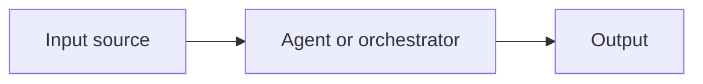

# Transformation Brief: <Process Name>

> Process slug: <slug>
> Date: YYYY-MM-DD
> Source diagnosis: processes/<slug>/<process-slug>/diagnosis.md
> Council state: council-states/<slug>/<date>-<process-slug>-transform.yaml
> Audience: <comp-team-internal | vp-people | external>
> engagement_mode: <mode_id>   # required — matches a v1 mode in engagement-modes.md

## Band Summary (categorical, not weighted)

| Candidate | Band | Rationale (one line) |
|-----------|------|----------------------|
| <name> | Quick Win | already in diagnosis Quick Wins |
| <name> | Strong Candidate | clear ROI + slack window in next 2 quarters |
| <name> | Needs Groundwork | blocked by HRIS data quality |
| <name> | Not Ready | integration cost unclear |

> Band assignments locked after council deliberation. Dissents preserved in council-state YAML.

---

## Strong Candidates — buildable specs

### <Candidate name>

#### Work components (work-decomposer 4-tuple)

- **Input:** <what data/signal triggers the work — be specific>
- **Context:** <what the work needs to know — policy, prior decisions, role context, audience>
- **Process:** <what the work does — transform, classify, route, decide, generate>
- **Output:** <what the work produces — artifact, decision, signal, escalation>

#### Architecture

- **Type:** simple | orchestrated | complex
- **Diagram (mermaid):**



#### Agent roles

##### Role: <name>

- **Input:** <specific input contract>
- **Task:** <one-line task description>
- **Output:** <specific output contract>
- **Context/Constraints:** <what this agent must respect — redaction, audience, policy>
- **Prompt template:**

```
<full prompt template — system + user, with placeholders like {input}, {context}>
```

##### Role: <name>

(Repeat for orchestrated / complex architectures.)

#### Quality gates

- **Self-critique:** <how the agent checks its own output before emitting>
- **Validation checks:** <deterministic rules that must pass — e.g., output schema validates, redaction pass runs clean>
- **Human review points:** <where a human must inspect — e.g., before payroll feed, before VP-facing artifact ships>

#### Cycle-fit

- **Earliest viable rollout:** <Qx YYYY> (slack window in <stage>)
- **Cycle-gating exception:** (only if user overrides — list reason)

#### Test scenario

<one full end-to-end test scenario the user could run on day 1 of rollout>

```
Given:
  - <input fixture>
When:
  - <trigger>
Then:
  - <expected output>
  - <quality gate passes>
```

---

### <Next Strong Candidate>

(Repeat sections.)

---

## Needs Groundwork — dependency notes

For each:

- **<Candidate name>**
  - What blocks it: <data quality / tooling gap / change readiness / integration unknown>
  - Who owns the unblocking: <role>
  - What would move it to Strong Candidate: <specific condition>
  - Estimated unblocking effort: <one-line, banded — solo / week / quarter / cross-team>

---

## Not Ready — parked

For each:

- **<Candidate name>** — <one-line: why parked>. Un-park condition: <what would change the status>.

---

## Council dissents (preserved verbatim)

Personas who dissented from the consensus band on any candidate, with their verbatim dissent. Preserved here so future revisits can correlate ledger outcomes against the dissenting view.

- `<persona slug>` on `<candidate>`: "<verbatim dissent>"
- `<persona slug>` on `<candidate>`: "<verbatim dissent>"

> If no dissents, write: "No dissents — council unanimous on band assignments."
